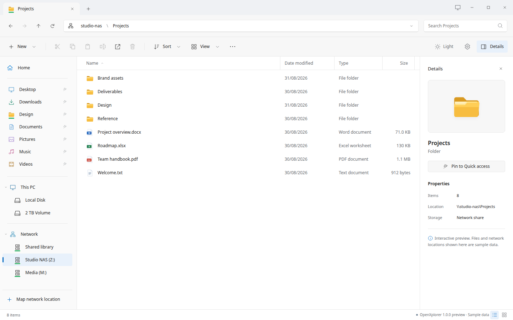

# OpenXplorer

A Windows File Explorer-inspired file manager, **developed for Zorin OS first and foremost**. Zorin is the primary target for its desktop experience and integration; Ubuntu and Debian are secondary compatibility targets and require compatible system packages.

Browse local folders and SMB shares with tabs, clickable paths, pinned folders, search and light/dark themes.

**[Releases](https://github.com/AKolenda/openxplorer/releases)** · **[Website](https://openxplorer.app)** · **[Installation](docs/installation.md)** · **[Documentation](docs/introduction.md)**



*Actual application HTML captured in Chromium with fictional files; not a native desktop or live-SMB test.*

## Install

Get the Debian package from [GitHub Releases](https://github.com/AKolenda/openxplorer/releases), then follow the [installation guide](docs/installation.md). Finish file operations and run `openxplorer --quit` before upgrading.

Version **1.0.0** is the first stable release. See the [changelog](desktop/CHANGELOG.md), [test report](TEST-REPORT.md) and [release checklist](docs/RELEASE-CHECKLIST.md) for what was verified and what stays your own environment's responsibility. File-manager defaults, browser settings, folder relocation and mount setup remain opt-in.

## Develop

The native Python/GTK/WebKitGTK app lives in `desktop/`; the Next.js website lives in `apps/web/`. The installed app does not depend on Node or pnpm.

For the website, use Node.js 22.13+ and pnpm 10.34.5:

```sh
pnpm install --frozen-lockfile
pnpm dev
```

See [desktop setup](desktop/README.md), [website setup](apps/web/README.md) and the [development guide](docs/development.md) for prerequisites, builds and checks.

## Contribute

Read [CONTRIBUTING.md](CONTRIBUTING.md) and submit a pull request from a feature branch. `main` requires PRs, including for administrators. Report vulnerabilities using [SECURITY.md](SECURITY.md).

## License

Project changes, website and project-authored documentation are **[AGPL-3.0-only](LICENSE)**, with documented file-level exceptions. Preserve the upstream Winspace [MIT notice](licenses/Winspace-MIT.txt), [NOTICE](NOTICE) and [third-party notices](THIRD_PARTY_NOTICES.md).

Independent project; not affiliated with Microsoft, Zorin, Canonical, Debian or Vercel. No warranty.
