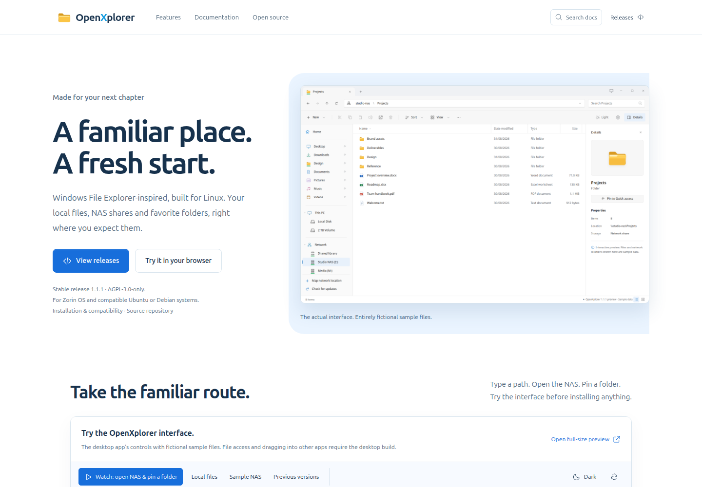
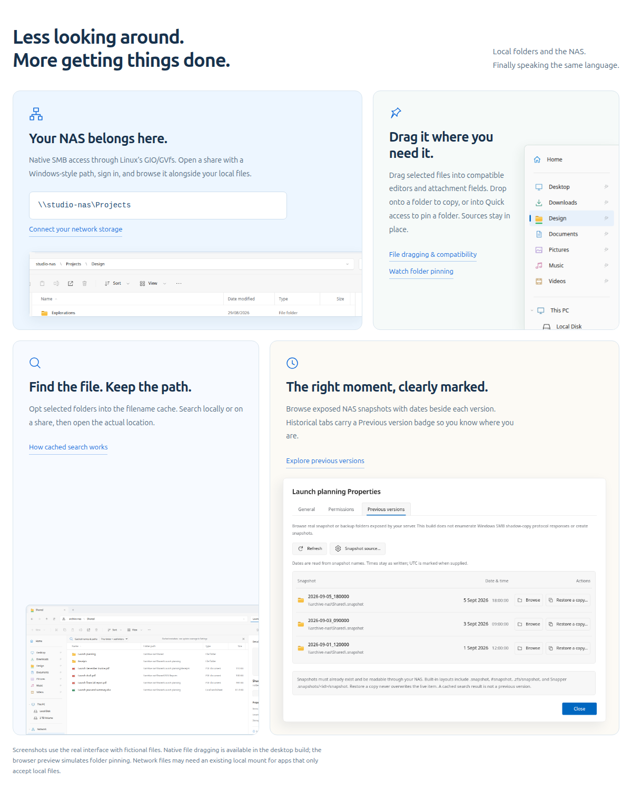

# OpenXplorer website

A Next.js App Router website for the open-source OpenXplorer file manager. The selected visual direction is **Zorin / Horizon**: white and pale-blue surfaces, clear typography, and the actual application—not a re-created explorer widget—at the center.


The image above is a Chromium capture of the actual app HTML with fictional sample files. [Capture manifest](public/assets/screenshots/manifest.json).

## Start with pnpm

From the repository root, using Node.js 22.13+:

```sh
corepack enable
corepack prepare pnpm@10.34.5 --activate
pnpm install --frozen-lockfile
pnpm audit --audit-level=moderate
pnpm dev
```

Development URL: `http://localhost:3000`.

```sh
pnpm check       # dependency-aware TypeScript check
pnpm build       # Next.js static export to apps/web/out/
pnpm preview     # serve exported output on port 3000
```

**Delivery status (2026-09-11):** dependency installation, dependency-aware
`pnpm check` and the real Next.js production export have passed. Use the supplied
`pnpm-lock.yaml` for frozen installs and review dependency changes with their
lockfile changes. Production-export browser and hydration checks also passed; see the current
test report for executed coverage. Cloudflare uses the separate project OAuth
profile described below.

## Mobile behavior and safe examples

Documentation topics open from the existing header menu on small screens; there is no horizontal topic strip. The current topic is marked and Escape closes the menu. The application preview is held in an inert `<template>` and instantiated only at 960 CSS pixels and above. Shrinking the viewport disposes it; mobile visitors see readable documentation and static screenshots instead of a cropped desktop app.

The homepage, documentation, browser demo and both READMEs use fictional fixture data. Do not substitute images from bug reports. Rebuild captures and run the [privacy audit](../../docs/PRIVACY.md) before publication:

```sh
python3 desktop/tools/build_preview.py
python3 tools/capture-screenshots.py
pnpm designs
python3 tools/capture-website.py
python3 tools/audit-public-data.py
python3 tests/test_mobile_review.py
```

These changes apply to the Next.js component/CSS source and the generated offline HTML. The standalone renderer is not a Next.js build.

## The website at a glance





These are captures of the standalone HTML rendered from the same site components. They are not evidence of a successful Next.js production build. Run `python3 tools/capture-website.py` from the repository root after `pnpm designs` to refresh them (Playwright, Chromium and Pillow required).

## The real interface, embedded

`components/product.tsx` embeds `/app-preview.html`, generated from `desktop/ui/` plus the preview-only tour controller in `desktop/demo/showcase.js`.

The preview has the real folder and file icons, tabs, breadcrumb buttons, menu behavior, pinning handlers and light/dark controls. Its storage adapter is simulated. It cannot access local files, NAS services, operating-system settings, credentials or a keyring.

The **Watch: open NAS & pin a folder** button starts a deterministic tour. An animated pointer types `\\studio-nas\Projects`, opens the sample share, drags **Design** through the existing pointer-based pin handler, then opens the pin. Stop, Reset, reduced-motion preferences and direct user interruption are supported. No animation starts automatically.

The iframe uses `sandbox="allow-scripts"` without `allow-same-origin`. Parent/child messages are scoped to the specific frame and a short allowlist of demo commands. Arbitrary URI or native-operation commands are not accepted. The app preview CSP blocks network requests. The native application does not load `demo/showcase.js`.

The standalone HTML renderer inlines the same preview as sandboxed `srcdoc` and screenshot PNGs as data URLs for convenient offline review. That renderer is **not** a replacement for a Next.js production build.

## Page structure

| Route | Purpose |
|---|---|
| `/` | Selected Zorin design, interactive app preview, SMB / pins / search / snapshots bento grid |
| `/docs/introduction/` | Guide entry point, real screenshot and interactive demo |
| `/docs/[slug]/` | Topic navigation left, article center, same-page navigation right |
| `/source/` | Public source repository and license information |
| `/concepts/` | Original three design directions, updated to use real application images |
| `/app-preview.html` | Standalone, interactive application UI with simulated files |
| `/docs-markdown/[slug].md` | Generated guide Markdown used by documentation tooling |

## Edit content and identity

`lib/site.ts` contains the application name, release version, public source repository,
GitHub Releases URL, canonical `https://openxplorer.app` URL and selected design.
Package buttons lead to GitHub Releases; source links lead to the public repository.
The website has no direct download links or hosted release binaries.

`lib/docs.json` is the canonical documentation source. Each section can contain paragraphs, a list, code, a callout, a real screenshot or the interactive preview. Run from the root:

```sh
python3 tools/sync-docs.py
node tools/prepare-web.cjs
pnpm designs
```

Each documentation page provides **Copy page as Markdown**, which copies the complete guide from the shared documentation content. Search is an ordinary labeled button; there is no Command-K badge or global Command-K handler.

## Screenshots, not substitute icons


All screenshots live in `public/assets/screenshots/`. `tools/capture-screenshots.py` uses the real app UI, including the file icons generated by `desktop/ui/app.js` and the date logic in `desktop/ui/snapshot-meta.js`.

To refresh screenshots:

```sh
python3 desktop/tools/build_preview.py
python3 tools/capture-screenshots.py
node tools/prepare-web.cjs
pnpm designs
```

Run those commands from the repository root. Python Playwright and Chromium are required. Set `CHROMIUM` for a different executable. Do not use a real customer share or capture credentials for marketing assets.

## Visual system

| Token | Value / purpose |
|---|---|
| Ink | `#17324D` — headings and primary text |
| Action blue | `#176EDB` — actions and navigation |
| Sky | `#EAF4FF` — the application surround and network feature card |
| White | `#FFFFFF` — reading and working surfaces |
| Network green | `#2EAF72` — network identification, not a health guarantee |
| Type | System Segoe UI / Ubuntu / Noto Sans; monospace only for code and paths |

The page’s distinctive element is a usable, full-width application preview. The
feature grid uses unequal cards and real screenshot crops. Keyboard focus,
mobile layout and reduced-motion behavior are retained. Below 960 CSS pixels,
the iframe is removed and visitors see the static screenshots and readable
content described above.

## Deployment and public source

`next.config.ts` uses `output: 'export'`. The site stays on Next.js and publishes
`apps/web/out/` through Cloudflare Workers Static Assets. The root
`wrangler.jsonc` targets the canonical `openxplorer.app` custom domain, uses
directory-style HTML routes and disables the public `workers.dev` route. No
framework migration, API service or database is required. Verify the current
deployment and its repository links on the final domain before announcing a release.

Use the dedicated project profile with the pinned, project-local Wrangler:

```sh
pnpm cf:login       # wrangler auth create openxplorer
pnpm cf:activate    # bind that profile to this directory
pnpm cf:profiles
pnpm cf:whoami
```

These named OAuth profiles are experimental in the installed Wrangler version.
The `openxplorer` profile is separate from the default profile. Environment API
tokens (`CLOUDFLARE_API_TOKEN`) take precedence over profiles and prevent profile
management; ensure an unrelated token is not selecting another account. Keep
credentials in Wrangler's local authentication storage, outside the source
tree. See [Cloudflare setup](../../docs/CLOUDFLARE-SETUP.md) for the exact account
and OAuth flow. The project profile has been authenticated independently of the default login.

Before publishing, build local release artifacts, audit the public data and rebuild:

```sh
pnpm check
pnpm audit --audit-level=moderate
pnpm designs
pnpm release
python3 tools/audit-public-data.py
pnpm build
pnpm cf:dry-run
pnpm cf:dev
# After reviewing the export and confirming the intended account/domain:
pnpm cf:deploy
```

The release script creates the `.deb`, corresponding-source ZIP and SHA-256
hashes only under the ignored local `dist/` directory and removes legacy
website download directories. Website calls to action go to the public GitHub
repository. The Cloudflare scripts explicitly select the `openxplorer` profile.
The dry run checks local packaging, not remote authorization or a successful
deployment. Check repository links, 404s and iframe CSP behavior in the served
export and then on the final domain. The export includes the static hosting
header rules; a local HTML file does not exercise those headers.

## Testing

```sh
node tools/check-syntax.cjs
python3 tests/test_website.py
python3 desktop/tests/ui_v09.py
```

The syntax check is not dependency-aware TypeScript verification. Standalone browser tests exercise the sandboxed iframe, tour, Markdown copying, mobile layout and documentation search with simulated storage. They do not test Next.js routing, hydration, hosting, native GTK/WebKit, real SMB or native authentication.

See the repository [test report](../../TEST-REPORT.md) and [contribution guide](../../CONTRIBUTING.md).

## License

AGPL-3.0-only for project-authored site code and documentation. The full license, original component notices and dependency notices remain in the repository. No external font files are included.

## 1.0 release gate

This source tree is 1.0.2. Keep the supplied lockfile under review and retain
`pnpm install --frozen-lockfile` in CI and release procedures. The real typecheck
and export are now verified separately from the standalone HTML renderer;
production hydration and deployment each need their own recorded checks.

Hosting rules include MIME-sniffing protection, a restricted feature policy
and frame/base/object restrictions. Their CSP is **not a strict script policy**;
review any tighter script rules against the actual exported Next.js output and
the sandboxed preview before enabling them.

The canonical domain is `openxplorer.app`. The source repository is public at
`https://github.com/AKolenda/openxplorer`; the website hosts no release binaries.
See the [public source checklist](../../docs/PUBLIC-RELEASE-CHECKLIST.md),
[stable-release checklist](../../docs/RELEASE-CHECKLIST.md) and
[Cloudflare setup](../../docs/CLOUDFLARE-SETUP.md) before publication.
