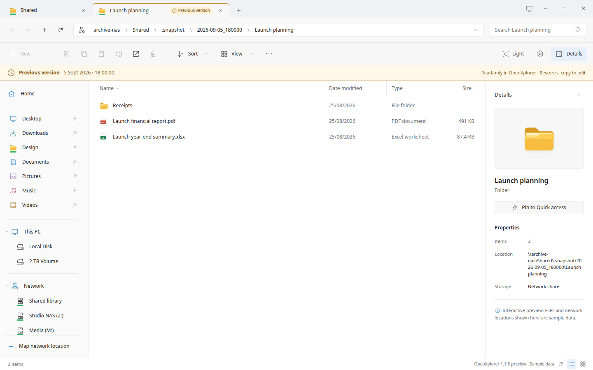
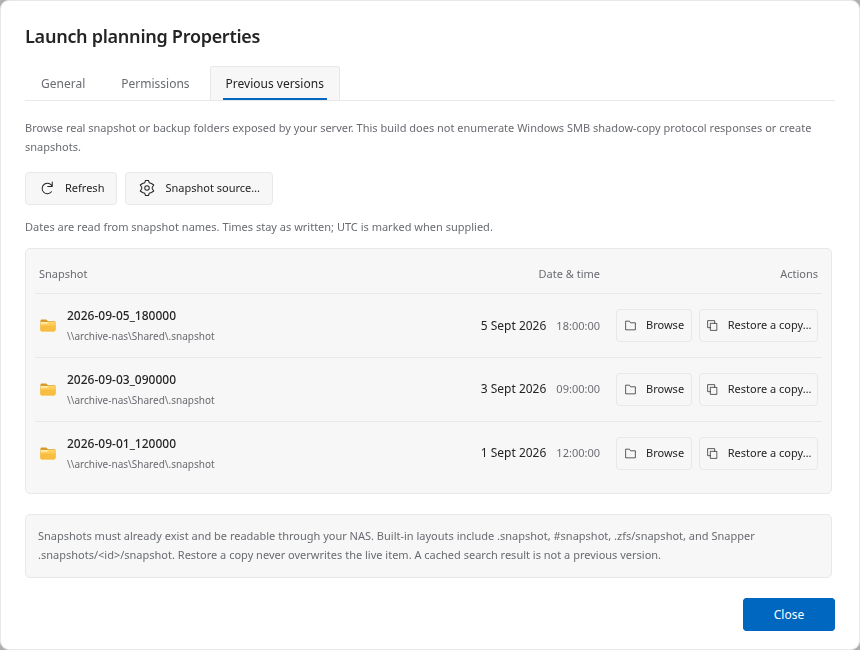

# Interface & snapshots

Make the workspace fit the way you work.

## Your workspace, your widths

Resize the sidebar and column edges. Double-click an edge to reset or fit it, depending on the control. Width preferences survive restarts. Local and SMB ancestors remain individual breadcrumb buttons.



*Actual HTML interface. Sample files; no live NAS connection.*

## Choose your context menu

Windows 10-style classic menus are the default; Settings can switch to the Windows 11-style compact option. Open with uses registered applications; identical editor names are deduplicated.

## Previous versions

Properties → Previous versions can browse existing, exposed snapshot collections. Opening a snapshot in another tab retains the original dialog on its originating tab. Restore a copy writes to a separate destination, not over the live original.

This provider recognizes exposed filesystem directories. It does not implement the Windows SMB shadow-copy enumeration protocol, create snapshots, or make backup history exist on a server.

Each previous-version row now includes a right-aligned date and time, followed by Browse and Restore a copy actions. Dates are parsed from recognized snapshot names, including auto-2026-09-04_16-30, 2026-09-05_180000, and @GMT names. A visible “From snapshot name” label explains the source. Unrecognized names show “Date unavailable”; folder modification times are not passed off as snapshot creation times.

@GMT timestamps are marked UTC. Other names are shown as written, without guessing a server timezone. This is display metadata, not a server-side ZFS creation-property query.

Snapshot tabs carry a “Previous version” badge and an amber top edge. A banner identifies the historical view and its read-only treatment in OpenXplorer, including when browsing deeper inside it. Network snapshot tabs keep their green network marker. The original Properties dialog still belongs to the original tab.



*Actual HTML interface. Sample files; no live NAS connection.*

## Measure folder sizes on demand

Calculate folder size totals accessible logical file sizes on a worker with progress and cancellation. Limits, excluded entries and read errors are shown as incomplete coverage. Results are session-only and can become stale.

These are not ZFS dataset used/referenced values, compressed allocation measurements or snapshot-exclusive block counts.

## Browse a ZIP, without extracting everything

ZIP browsing is read-only. Listing reads archive metadata; opening a selected member decompresses that member into a private temporary copy. Archive modifications, encrypted archives and unsupported formats require an external application.

## Extract ZIP files

Right-click a ZIP and choose Extract all… in either context-menu style. Choose an existing destination and a new output-folder name. The ZIP stays unchanged, existing files are never overwritten, and Cancel is available in the transfer panel.

Local and already connected SMB locations are supported by the implementation; live SMB extraction still needs target-machine validation. Sign into the relevant shares first. Password-protected ZIPs, unsupported methods, and files exceeding the built-in safety limits need an external archive manager. Double-click continues to browse without extracting the entire ZIP.

## Make text easier to read

Ctrl + (or Ctrl =) increases text, Ctrl − decreases it, and Ctrl 0 resets to 100%. Settings → Appearance & layout → Text size offers 80% through 200%. The preference is saved across restarts and applied to open windows.

Only the application text and needed row spacing change; desktop scaling and file data remain unchanged. Sidebar and column widths remain resizable.

## Open in Terminal

Right-click a folder, sidebar pin or the file-list background and choose Open in Terminal. Right-click a regular file to open its containing folder. Both context-menu styles include the command.

A connected SMB location needs a usable local CIFS or GVfs-FUSE mount. The shell runs on your Linux computer, not on the NAS. No SSH session or remote command is created. Server listings, ZIP contents and protected snapshot views cannot be used as a terminal directory.

The system terminal alternative is used when supported; otherwise an installed GNOME Terminal, Console, Xfce Terminal, Konsole or XTerm is selected. Paths are passed as literal arguments and working directories, not shell command strings. The browser preview simulates this action and starts no program.

```sh
sudo apt install gnome-terminal
```

## Middle-click and move tabs

Middle-click a folder, connected share, breadcrumb or sidebar location to open a background tab. Shift+middle-click also switches to it. Middle-click an existing tab to close it. Background directories load when selected, so opening a network tab does not immediately interrupt you with a login dialog.

Drag a tab onto another OpenXplorer tab strip to merge it. To open a separate window, drop on a supported desktop, or drag down into the source window until the new-window hint appears. The Move tab to new window menu remains available. Escape cancels; the original tab is kept until the destination acknowledges it.

## Drag files between applications

Select one or more files or folders and drag them into an application that accepts native file drops. The desktop app supplies file URIs and readable paths through GTK, including already-mounted network paths when available. Ctrl-click or Shift-click to select multiple items. Press Escape to cancel.

Drop files into an OpenXplorer folder, the empty area of the current folder, or another OpenXplorer window to propose a copy. Choose Replace existing or Skip duplicates. Incoming data is staged before file replacement; same-name folders merge and keep destination-only entries. File/folder type conflicts are left unchanged. Quick access drops pin or reorder folders. File drops never request deletion of the source.

ZIP members must be extracted first. Some editors only accept local files: network items need an existing GVfs/FUSE or CIFS path for those applications. Dragging does not mount a share or download a temporary copy. Drag-to-move, automatic extraction, and undo remain unavailable; use Cut and Paste for supported same-filesystem moves.

The website preview uses sample files and cannot export desktop files. Compatibility with a particular editor or a Wayland desktop must be checked on that system.

---

OpenXplorer 1.1.3. Project-authored documentation: AGPL-3.0-only.
