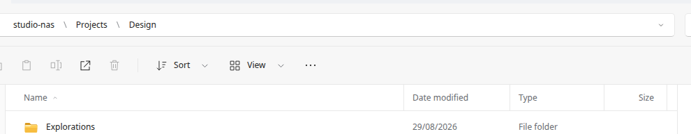
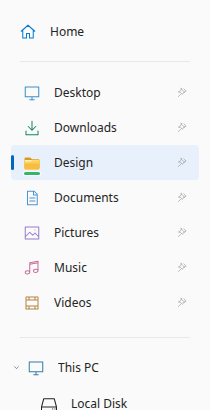

# SMB & network shares

Browse your network without losing your sense of place.

## Connect to a server

Open Network and enter a server or share address. The address bar also accepts Linux paths, UNC paths and smb:// locations. Each breadcrumb is separately clickable.

Windows-style paths use backslashes, not backticks: \\studio-nas\Projects. You can also use smb://studio-nas/Projects. Click each breadcrumb to jump to an ancestor. The website walkthrough uses this exact interface; the website itself makes no SMB connections.

```sh
\\nas\Projects
smb://nas/Projects
```



*Actual HTML interface. Sample files; no live NAS connection.*

## Sign in, once per server when possible

The in-app prompt accepts a username and password. Remember my credentials requests persistent system-keyring storage. When unchecked, reusable credentials are scoped to the Linux login session if the Secret Service session collection is available.

Accounts are scoped by server and port. Different host aliases, rejected credentials, or shares requiring another account may prompt again. A locked keyring can show an operating-system unlock dialog; it is not the SMB credential prompt.

## Keep a share in reach

Successfully browsed locations appear beneath Network for the session. Right-click a share and choose Keep in Network to save it. Pin a share or a nested folder into the sidebar for a direct route back. Green marks indicate network-backed locations, not guaranteed online status.

The website’s replayable pointer demonstration opens a sample NAS by its UNC path, drags Design to the sidebar, and opens the resulting pin. This goes through the preview’s existing pointer handlers. It is a deterministic demonstration on fictional files, not a recording of a live NAS.



*Actual HTML interface. Sample files; no live NAS connection.*

## Discover nearby servers

Discover servers uses the installed GVfs discovery providers. Devices must advertise themselves and be reachable through your network and firewall. It does not scan every IP address or guarantee an exhaustive list.

## Bookmarks are not persistent mounts

For a Downloads location or an application that needs a filesystem path, use a persistent CIFS mount. A bookmark such as smb://nas/Downloads is a browsing shortcut, not a system-wide mount. The optional mount helper requires reviewed, explicit administrative action.

## Sign out safely

Finish operations and close files on the server first. Sign out can disconnect matching desktop-session SMB mounts used by other applications. Forgetting saved credentials and removing filename-cache entries are separate choices; neither deletes server files.

---

OpenXplorer 1.0.0-rc.4. Project-authored documentation: AGPL-3.0-only.
