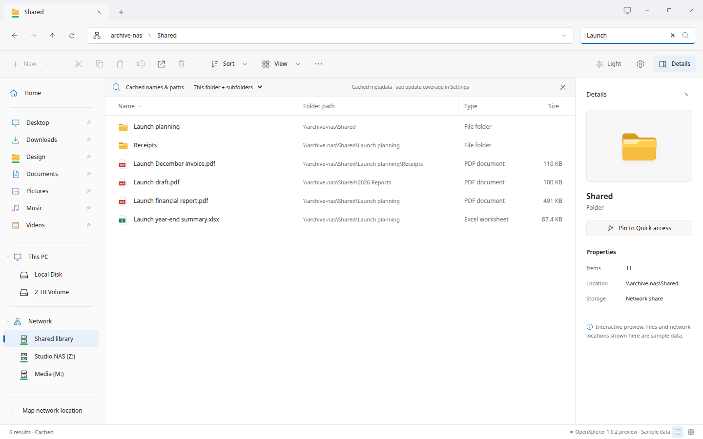

# Search & indexing

Search names and paths from a local index. Keep the boundaries clear.

## Choose what gets indexed

Settings → Search & indexing lists folders, SMB shares and mounted volumes. Check a root or add a custom path to index its filenames and metadata. The initial scan does not download file contents.

Each mounted filesystem is selected separately. Selecting Local Disk does not automatically traverse every other mounted volume.

## Local events, network checks

Local selected directories use filesystem watches while the app is open. Network shares use incremental directory checks, not SMB server-side push notifications. After the app has been closed, reconciliation catches missed changes.

## Results open their real locations

A result includes its parent path. Opening a directory navigates to the actual folder; opening a file checks current metadata and launches an appropriate application. Stale results can remain when a server is offline.

*Actual HTML interface. Sample files; no live NAS connection.*

## Coverage and limits

The current implementation limits an initial root scan to one million entries, watches up to 8,192 local directories, and uses timed fallback beyond watch coverage. Search displays the first 500 matches and indicates truncation. System/temporary trees, snapshot collections, links and nested mounts are excluded from whole-disk traversal.

## The index stays on your machine

The database contains filenames and paths, which can be sensitive. Disable a root to remove its indexed records. An overlapping root can still contain the same names. The cache is not encrypted and is not an offline copy of file contents.

## Need a nearby file? Just type.

Click the current file list and type SC to select a loaded filename beginning with those letters. This does not filter the view, search subfolders, or contact the NAS for each keystroke. Press Enter to open it.

---

OpenXplorer 1.0.2. Project-authored documentation: AGPL-3.0-only.
